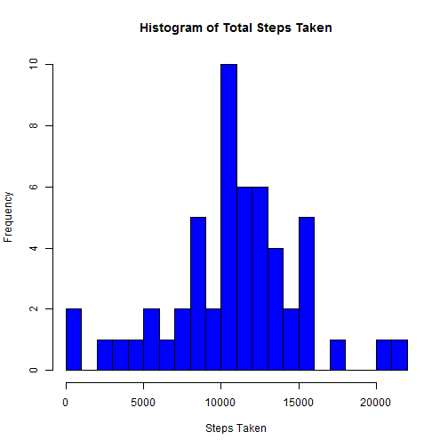
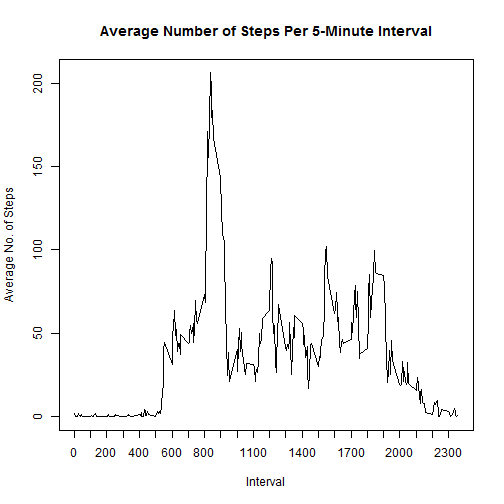
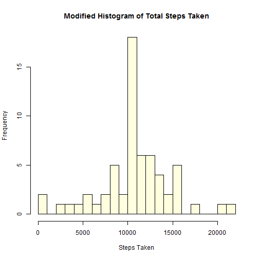
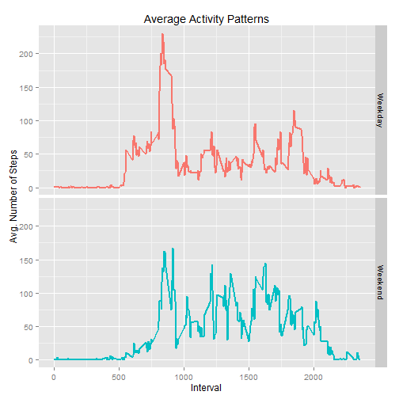

### About this R Markdown document:
This is an R Markdown document for the study of personal movement using activity monitoring devices such as Fitbit, Nike Fuelband, or Jawbone.  

### Loading and preprocessing the data
The first step is to download the data from an external source and then load it into a dataframe

```r
if (!file.exists("./Exploratory Data Analysis")) {
        dir.create("./Exploratory Data Analysis")
}

projectFile <- "http://d396qusza40orc.cloudfront.net/repdata%2Fdata%2Factivity.zip"
download.file(projectFile, destfile = "./Reproducible Research/Activity_Dataset.zip")
unzip("./Reproducible Research/Activity_Dataset.zip", files = NULL, 
      exdir = "./Reproducible Research", 
      overwrite = TRUE)

data <- read.csv("./Reproducible Research/activity.csv")
```

### What is mean total number of steps taken per day?

In this next step, the raw data will be cleaned up so as to discard any rows with NA values in the "steps" column.  From there, the total number of steps per date grouping will be calculated using the ddply function from the plyr package.  


```r
library(plyr)
total.steps <- ddply(na.omit(data), c("date"), summarize, totalSteps = sum(steps))
total.steps
```

```
##          date totalSteps
## 1  2012-10-02        126
## 2  2012-10-03      11352
## 3  2012-10-04      12116
## 4  2012-10-05      13294
## 5  2012-10-06      15420
## 6  2012-10-07      11015
## 7  2012-10-09      12811
## 8  2012-10-10       9900
## 9  2012-10-11      10304
## 10 2012-10-12      17382
## 11 2012-10-13      12426
## 12 2012-10-14      15098
## 13 2012-10-15      10139
## 14 2012-10-16      15084
## 15 2012-10-17      13452
## 16 2012-10-18      10056
## 17 2012-10-19      11829
## 18 2012-10-20      10395
## 19 2012-10-21       8821
## 20 2012-10-22      13460
## 21 2012-10-23       8918
## 22 2012-10-24       8355
## 23 2012-10-25       2492
## 24 2012-10-26       6778
## 25 2012-10-27      10119
## 26 2012-10-28      11458
## 27 2012-10-29       5018
## 28 2012-10-30       9819
## 29 2012-10-31      15414
## 30 2012-11-02      10600
## 31 2012-11-03      10571
## 32 2012-11-05      10439
## 33 2012-11-06       8334
## 34 2012-11-07      12883
## 35 2012-11-08       3219
## 36 2012-11-11      12608
## 37 2012-11-12      10765
## 38 2012-11-13       7336
## 39 2012-11-15         41
## 40 2012-11-16       5441
## 41 2012-11-17      14339
## 42 2012-11-18      15110
## 43 2012-11-19       8841
## 44 2012-11-20       4472
## 45 2012-11-21      12787
## 46 2012-11-22      20427
## 47 2012-11-23      21194
## 48 2012-11-24      14478
## 49 2012-11-25      11834
## 50 2012-11-26      11162
## 51 2012-11-27      13646
## 52 2012-11-28      10183
## 53 2012-11-29       7047
```

The Total Steps calculated above for each day is now shown pictorially via a histogram.


```r
hist(total.steps$totalSteps, breaks=20, xlab="Steps Taken", main="Histogram of Total Steps Taken", col="blue")
```

 

Here is the dataset showing the mean and median of steps taken per day:


```r
summary.mean <- mean(total.steps$totalSteps)
summary.median <- median(total.steps$totalSteps)

summary.mean
```

```
## [1] 10766.19
```

```r
summary.median
```

```
## [1] 10765
```

### What is the average daily activity pattern?

In this next section, the average daily activity pattern will be calculated for each 5-minute interval across all days.  What is being determined is which 5-minute interval, on average across all the days in the dataset, contains the maximum number of steps.  Based on the time-series plot, the 5-minute interval with the highest average of steps taken occurs around 8:35am each day.


```r
interval.mean <- ddply(na.omit(data), "interval", summarize,
                 mean = mean(steps, na.rm=TRUE))
                 
with(interval.mean, plot(interval, mean, 
                           type="l", 
                           xaxt="n",
                           xlab="Interval", 
                           ylab = "Average No. of Steps", 
                           xlim=c(0,2360),
                           main="Average Number of Steps Per 5-Minute Interval"))
axis(1, at=seq(0, 2360, by=100))
```

 


### Inputting missing values
This next section examines the NA's that are in the dataset.  First off, let's count the number of NA's present in the dataset


```r
count.of.NAs <- sum(is.na(data))
print(count.of.NAs)
```

```
## [1] 2304
```

In this next section, the NAs will be replaced with the mean value for that specific 5-minute interval.  This is achieved by first creating a separate dataset of all rows that do not contain nulls.  Next, another dataset that contains rows in which there are null values for the steps is then created.  Next, the mean value for each 5-minute interval is then calculated across all the days.  Then, using the interval value as the identifying attribute within each dataset, the null value of the "steps" column in the dataset containing the null values is then replaced with the mean value calculated.


```r
interval.mean <- ddply(na.omit(data), "interval", summarize,
                       mean = mean(steps, na.rm=TRUE))

data.nulls <- data[is.na(data$steps),]
data.not.nulls <- na.omit(data)

intval <- 0
last.intval <- 2355
while (intval <= last.intval) {
        data.nulls[data.nulls$interval==intval,1] <- as.integer(interval.mean[interval.mean$interval==intval, 2])
        intval <- intval + 5
}

data.not.nulls <- rbind(data.not.nulls, data.nulls)
ordered.data <- data.not.nulls[order(data.not.nulls$date),]
```

Using the new dataset of complete values created above, this next section will then calculate the total number of steps taken per day with null values replaced.  


```r
library(plyr)
total.steps.mod <- ddply(ordered.data, c("date"), summarize, totalSteps = sum(steps))
total.steps.mod
```

```
##          date totalSteps
## 1  2012-10-01      10641
## 2  2012-10-02        126
## 3  2012-10-03      11352
## 4  2012-10-04      12116
## 5  2012-10-05      13294
## 6  2012-10-06      15420
## 7  2012-10-07      11015
## 8  2012-10-08      10641
## 9  2012-10-09      12811
## 10 2012-10-10       9900
## 11 2012-10-11      10304
## 12 2012-10-12      17382
## 13 2012-10-13      12426
## 14 2012-10-14      15098
## 15 2012-10-15      10139
## 16 2012-10-16      15084
## 17 2012-10-17      13452
## 18 2012-10-18      10056
## 19 2012-10-19      11829
## 20 2012-10-20      10395
## 21 2012-10-21       8821
## 22 2012-10-22      13460
## 23 2012-10-23       8918
## 24 2012-10-24       8355
## 25 2012-10-25       2492
## 26 2012-10-26       6778
## 27 2012-10-27      10119
## 28 2012-10-28      11458
## 29 2012-10-29       5018
## 30 2012-10-30       9819
## 31 2012-10-31      15414
## 32 2012-11-01      10641
## 33 2012-11-02      10600
## 34 2012-11-03      10571
## 35 2012-11-04      10641
## 36 2012-11-05      10439
## 37 2012-11-06       8334
## 38 2012-11-07      12883
## 39 2012-11-08       3219
## 40 2012-11-09      10641
## 41 2012-11-10      10641
## 42 2012-11-11      12608
## 43 2012-11-12      10765
## 44 2012-11-13       7336
## 45 2012-11-14      10641
## 46 2012-11-15         41
## 47 2012-11-16       5441
## 48 2012-11-17      14339
## 49 2012-11-18      15110
## 50 2012-11-19       8841
## 51 2012-11-20       4472
## 52 2012-11-21      12787
## 53 2012-11-22      20427
## 54 2012-11-23      21194
## 55 2012-11-24      14478
## 56 2012-11-25      11834
## 57 2012-11-26      11162
## 58 2012-11-27      13646
## 59 2012-11-28      10183
## 60 2012-11-29       7047
## 61 2012-11-30      10641
```

The histogram that follows will show that the total number of steps per day is higher in this dataset, now that all null values have been replaced with mean values.


```r
hist(total.steps.mod$totalSteps, breaks=20, xlab="Steps Taken", main="Modified Histogram of Total Steps Taken", col="lightyellow")
```

 

Despite having higher total-steps value calculated in the dataset above, the data shows that the reported values of both the mean and median are slightly lower.


```r
summaryMean.mod <- mean(total.steps.mod$totalSteps)
summaryMedian.mod <- median(total.steps.mod$totalSteps)


print(summaryMean.mod)
```

```
## [1] 10749.77
```

```r
print(summaryMedian.mod)
```

```
## [1] 10641
```

### Are there differences in activity patterns between weekdays and weekends?

In this section, the dates in the dataset will be designated as either a "weekday" or a "weekend" as a new factor variable.  Once designated, the average number of steps taken across all weekdays or weekend days will be calculated for each 5-minute interval.


```r
ordered.data$day <- weekdays(as.Date(ordered.data$date))
ordered.data$day <- as.factor(ordered.data$day)
ordered.data$daydesig <- as.factor(ifelse(ordered.data$day %in% c("Saturday","Sunday"), "Weekend", "Weekday"))

interval.mean.weekday <- ddply(ordered.data, c("interval", "daydesig"), summarize,
                 mean = mean(steps))
```

Once the average number of steps taken across all weekdays or weekend days have been calculated for each 5-minute interval, the result set will then be plotted in a time-series plot (as shown below).


```r
library(ggplot2)
weekplot <- ggplot(interval.mean.weekday, aes(x=interval, y=mean, group=daydesig, color=daydesig)) +
        geom_line(size=.8) +
        facet_grid(daydesig ~ .) + 
        xlab("Interval") + ylab("Avg. Number of Steps") +
        theme(legend.position="none") +
        ggtitle("Average Activity Patterns")

print(weekplot)
```

 

